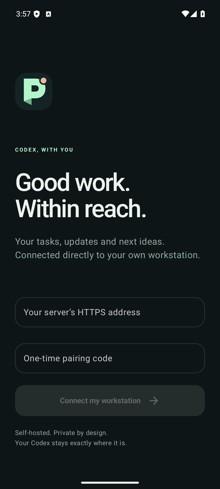

<p align="center"></p>

# NextComp

Formerly Pocket; existing installs, pairings, package IDs and deep links remain compatible.

**Your Codex workstation, within reach.** A self-hosted Android companion for stock Codex CLI by [FallSoft](https://github.com/fallsoftco).

Start tasks from your phone, follow the conversation in order, and reply when Codex needs you. Pocket connects to your existing Codex runtime; no fork, app store, or FallSoft-operated server is required.

[Download the Android alpha](https://github.com/fallsoftco/pocket/releases) · [Setup](#setup) · [Privacy](PRIVACY.md) · [Security](SECURITY.md) · [Verification](docs/VERIFICATION.md)

> **Experimental alpha.** Workstation mode is tested with Codex CLI 0.157.1 on Linux. Phone-local mode is tested with stock Codex CLI 0.158.0 in Termux on a Pixel 9 Pro Fold. Both use Codex's experimental app-server protocol without a fork. This is an independent project, not an OpenAI product.

## What it does

- See your weekly Codex allowance, remaining percentage, and reset time in a persistent strip on every screen. Cached usage is marked as last known when disconnected.
- Start a task in a workstation project, or continue an existing conversation.
- Read prompts, progress, commands, tool results, file changes, questions, and final responses in chronological order. Expand output and load earlier turns.
- Tap Send or press Enter to send; active-turn input steers the task. Hold the button to queue a follow-up. Shift+Enter adds a line break. The queue count opens edit, remove, send-now and resume controls. An empty composer shows Stop while work is running.
- Choose the next turn’s model, reasoning effort, and Plan/Build mode from conversation actions. Rename, archive, and restore conversations.
- Reply from an Android notification and answer native questions and supported approvals.
- Receive Firebase push when followed work finishes or needs your attention.
- Ask Codex to notify you under a condition: **“Use Pocket to notify me when the tests pass, with a short summary.”**
- Choose synthesized tones, offline spoken labels or content summaries, or system notification audio. Actionable items have bounded reminders, dismissal, and snooze.
- Open explicitly shared attachments from your authenticated workstation.
- Run Codex on the Android phone itself and switch between **Workstation** and **This phone**.
- Optionally let phone-local Codex inspect the foreground Android screen, take screenshots, tap, scroll, enter non-password text, and use Android navigation.

Pocket is for **one owner and their trusted phones**. A paired phone can read and control that owner's Codex tasks. It is not a shared hosting or multi-user permissions system.

<p></p>

## How it connects

```text
Workstation: Codex CLI ← shared socket → Pocket backend ← HTTPS/WebSocket → Android
                                                       ↑ FCM alerts
                                                  your Firebase project

On phone:    stock Codex app-server ← stdio → Pocket bridge ← loopback → Android
                                                   ↕ authenticated loopback
                                           accessibility control service
```

Your workstation hosts the application and stores task data. Firebase Cloud Messaging (FCM) transports notification titles and bounded text previews through Google. Full transcripts and attachments are fetched from your workstation. The APK gets your Firebase client configuration when paired; it contains no shared Firebase project or server credential.

## Requirements

- Linux workstation with Node.js **22.13+**, authenticated Codex CLI, and its shared app-server socket.
- Android **9+ (API 28)** with Google Play services for FCM. Physical testing currently covers a Pixel 9 Pro Fold; other vendors are unverified.
- Your own Firebase project with Cloud Messaging enabled and a server credential.
- A trusted HTTPS connection from phone to workstation. Tailscale Serve is the recommended private-network deployment. Both devices must belong to your tailnet to read/reply; FCM alerts can arrive without Tailscale connected.

The workstation must remain online for Codex work and new notifications. There is no always-on Android foreground service or battery-exemption requirement. Android force-stop prevents push until you reopen the app.

## Setup

### 1. Install the backend

```bash
git clone https://github.com/fallsoftco/pocket.git pocket
cd pocket
npm ci
```

Run Codex CLI **0.157.1** interactively and authenticate it. In another terminal, from the Pocket checkout, check compatibility **before configuring Firebase**:

```bash
codex --version
npm run doctor -- --preflight
```

The preflight does not require Firebase or a running Pocket backend. It checks that the existing shared Codex runtime responds. Stop here if it fails; see [missing-socket troubleshooting](docs/DEPLOYMENT.md#diagnosis). Other Codex versions are unverified.

Pocket connects to the existing socket at `~/.codex/app-server-control/app-server-control.sock` (or under `CODEX_HOME`). Set `CODEX_SOCKET` if your installation uses another existing shared socket. Use the same OS user and Codex home as the interactive CLI. Pocket does not start a competing app-server or migrate your conversations.

### 2. Configure your Firebase project

Follow the [Firebase setup walkthrough](docs/FIREBASE.md). It gives copyable commands for enabling APIs, creating a temporary setup account and a separate push-only sender, and removing the setup account afterward. You need your own Firebase project and permission to manage those project resources.

```bash
node scripts/configure-firebase.mjs YOUR_PROJECT_ID /private/path/setup.json /private/path/sender.json
```

This registers the Android package `co.fallsoft.pocket` if needed and writes private configuration into ignored `data/`. With separate credentials, only the sender key is retained. Its sole required permission is `cloudmessaging.messages.create`. Keep keys outside the checkout and out of support reports.

The same signed APK works with each owner's Firebase project. You do not need to rebuild it, add `google-services.json`, or share credentials with FallSoft.

### 3. Start and expose Pocket privately

```bash
npm start
```

Keep that running; in another terminal:

```bash
tailscale serve --bg --https=8447 http://127.0.0.1:18880
npm run doctor
```

Use the HTTPS address printed by Tailscale. Do **not** use Funnel or expose the raw Codex socket. The backend binds only to loopback. If port 8447 is already used by another service, select a free HTTPS port. For background startup, adapt [the systemd template](deploy/codex-pocket.service.example) using [the deployment guide](docs/DEPLOYMENT.md).

### 4. Install and pair Android

Download `pocket-0.5.0-alpha.8.apk` from [Releases](https://github.com/fallsoftco/pocket/releases), verify its checksum, and install it. Android will ask to allow installation from your browser or file manager. Alternatively use `adb install pocket-0.5.0-alpha.8.apk`.

On the workstation, from the checkout:

```bash
POCKET_PUBLIC_URL=https://YOUR_WORKSTATION.YOUR_TAILNET.ts.net:8447 node scripts/pair-device.mjs
```

Enter that HTTPS address and the one-time code in Pocket, then grant notification permission. Codes expire after 15 minutes and work once. An optional ADB device argument opens the prefilled form; it still requires tapping Connect.

In Settings, wait for **Firebase push is ready**, then send a test notification. This checks your own project/device configuration.

### 5. Let Codex notify you

```bash
codex mcp add pocket -- node /absolute/path/pocket/server/mcp.mjs
```

Start a new Codex client session so it loads the tool. Ask it when you want a notification. The `notify_user` tool uses the current `CODEX_THREAD_ID`; it never chooses another recipient. Custom data directories/ports must also be passed to the MCP command; see [deployment](docs/DEPLOYMENT.md).

## Run Codex on the phone

Pocket can also connect to stock Codex CLI running in Termux on the same Android device. This mode needs no Firebase project, Tailscale route, hosted relay, or app-store install. Install the APK and follow the [Android-local setup](docs/ANDROID_LOCAL.md). The short path from a Termux clone is:

```bash
./scripts/install-codex-android.sh
codex-phone login --device-auth
npm ci
npm run android-local
```

The installer creates a private loopback bridge, a managed Termux service, reboot startup for Termux:Boot, and the `pocket-phone` MCP server. Pocket keeps workstation and phone profiles side by side.

Phone control is optional. Enable **Pocket** in Android Accessibility, then enable **Control this phone** in Pocket. After those two owner-controlled gates are enabled, all `pocket-phone` tools are preapproved so requested taps, text entry, scrolling, and navigation can proceed without repeated prompts. Password fields are omitted and cannot be filled. Ask naturally, for example: **“Open Instagram, scroll my feed, and tell me which posts are about music.”** Posting, messaging, purchases, deletion, and account or security changes still require a direct instruction for that exact action. Custom-drawn surfaces and some WebViews may require screenshot-and-coordinate control rather than semantic elements.

## Everyday use

Search tasks by title or project folder. Use Recent, Working, and Following to narrow the list. Search matches titles and full project paths without regard to letter case. Clear the search field to show all tasks in the selected view again.

**New task** selects an existing absolute workstation folder and prompt. Codex inherits the workstation's model, approval settings, and project instructions. Task creation and replies use durable IDs; ambiguous delivery is shown for review instead of automatically duplicating work.

Followed tasks recover missed completion/failure alerts after the Pocket backend reconnects or restarts, using saved turn IDs to prevent duplicates. The first upgrade establishes a baseline without notifying for old completed work.

Open a task and tap its bell to follow it. Replying also follows it. The conversation preserves turn/item order, including compact expandable commands and diffs. Scroll up without losing your place; **Latest** returns to live activity. **Load earlier activity** pages backward. Public reasoning summaries can appear; raw reasoning is excluded.

**Queued** means Pocket received a reply; **sent** means Codex accepted it, not that the task finished. Native questions and supported command/file approvals retain their exact outstanding request IDs. Unsupported request types must be handled in the terminal. Approval requests are shown when the task uses approval mode; full-permission tasks run commands without approval prompts.

Questions, approvals, and errors appear in **Needs you**. Reminders use delays of 5 minutes, then 15 and 30 minutes between repeats, up to three repeats. Swipe away, dismiss, reply, or resolve the request to stop them. **Later · 30m** snoozes. Android may delay these approximate timers; opening a task alone does not dismiss its request.

**Labels** prepares generic phrases using an installed offline English voice. **Speak messages** opts into reading the complete spoken version of notification content, including while the phone is locked. Codex can supply an optional `spoken_summary` to `notify_user`; otherwise the backend reads the cleaned title and message. The spoken version supports the same 32,000-character input budget as a notification, without a separate word cutoff. It is not a separate AI interpretation. Code blocks, URLs and long paths are removed.

Each new spoken notification starts with an approximately three-word summary of the input being answered, then reads the response. It uses the turn’s user message instead of the conversation title. Notification tools can supply a natural `spoken_context`; automatic alerts fall back to a short prompt-derived topic.

Speech is generated entirely on the phone and played with Android media controls. **Pause** saves the current audio position; **Resume** continues from there. Controls appear in the playback notification and a compact player inside Pocket. Music taking audio focus saves and pauses speech until you choose Resume. Brief interruptions pause and resume automatically, while notification chimes duck the voice without stranding the queue. If media is already playing, new speech waits; new notifications also wait behind a manually paused message. Pausing releases the audio focus and stops the playback service; the private queue and current audio chunk remain on the phone. Dismissing the paused notification does not erase them: reopen Pocket to resume, or use the player's menu to **Clear saved speech**. Disabling Speak messages or disconnecting the phone clears saved speech. Normal process recreation restores the saved queue in a paused state; abrupt process death may replay up to the last two seconds since the last checkpoint.

Long messages continue in ordered chunks without a total playback deadline. Completed audio chunks are deleted. Speech uses media volume and also respects silent/vibrate mode, notification mute, Do Not Disturb and headphone disconnection. It does not read historical notification catch-up or repeatedly speak reminders. Nothing is sent to an external speech service. Firebase carries short speech directly; longer text is fetched through the authenticated workstation connection. If that connection is unavailable, the message stays saved with a reconnect explanation; Resume retries loading it.

## Connection troubleshooting

Pocket releases the displayed transcript when you leave a task and replaces the previous history page when you load earlier activity. **Back to latest** returns to live work. Reload clears the current display state; Android memory-pressure cleanup releases it too. Pairing, drafts, pending replies, and the original Codex history are preserved.

The workstation’s live display cache has an 8 MiB serialized-entry budget, a 32-thread limit, and a 15-minute idle expiry. It clears on Codex disconnection and replaces stale entries with fresh snapshots. Paginated history loads at most 400 display items and 1 MiB of serialized display items per page, including continuation within a long turn. Large individual text fields are marked as excerpts; original content remains on the workstation.

Pocket distinguishes **phone → workstation** failures from **workstation → Codex** failures. The connection banner explains which link needs attention and offers **Retry now**. Failed loads offer **Reload conversation**; reconnecting refreshes the open task automatically. These actions reload data without resending replies.

Large conversations using Codex’s paginated history load recent turns and bounded item pages. **Load earlier activity** fetches the preceding page. This avoids requesting an entire long conversation in one WebSocket message. If a single response still exceeds the limit, Pocket reports that specific cause instead of just “Codex disconnected.”

If Pocket reports that it cannot resolve the workstation name, check that Tailscale is connected on both devices and that the phone is using Tailscale DNS. In Pocket settings, **Reconnect now** retries immediately without unpairing.

After a successful HTTPS connection, Pocket remembers the workstation’s verified Tailscale address. If Android later fails to resolve that same `.ts.net` hostname, API calls, the live connection, and attachment loading can use the saved address. The HTTPS hostname and certificate checks stay unchanged. Normal DNS always takes precedence; the fallback requires an earlier successful connection and a working Tailscale route.

## Manage devices and data

```bash
node scripts/devices.mjs list
node scripts/devices.mjs revoke DEVICE_ID
```

Revocation closes that device's live connections and removes its push registration. It cannot erase already delivered content from a phone. Unpairing while offline only clears the phone immediately; revoke on the workstation if the server was unreachable.

`data/` contains credentials, paired-device records, notifications, outbox state, and shared attachments. Keep it private and back it up securely. The owner token grants local administration. Never include this directory in a support report. See [privacy](PRIVACY.md) and [security](SECURITY.md).

## Develop and build

```bash
npm test
npm audit --omit=dev
cd android
./gradlew testDebugUnitTest assembleDebug lintRelease
```

Android builds need JDK 17+, SDK 36, and an SDK path in `ANDROID_HOME` or ignored `android/local.properties`. The Gradle wrapper is included. See [release signing and upgrades](docs/RELEASING.md) for signed builds. GitHub Actions runs backend tests, dependency audit, Android resolver tests, lint, and an unsigned release build.

Public alpha builds use a stable FallSoft release certificate. They cannot update earlier personal debug builds or independently signed builds in place. See the migration instructions before uninstalling anything.

Original code and icon are [MIT licensed](LICENSE). Third-party components retain their own licenses; see [notices](THIRD_PARTY_NOTICES.md). Contributions and reproducible bug reports are welcome; remove private task text and credentials first.

New Pocket tasks default to full filesystem/network access with command approvals disabled. Change **Full permissions for new tasks** in Settings or on the New task screen; turning it off uses workspace access and approval requests on the workstation (phone-local tasks keep their required full filesystem access). The choice is saved for future tasks, and each task retains its permissions when Pocket reconnects.

## Eyes-free voice mode

Tap **Talk to Codex** on the session list for the persistent coordinator, or tap the microphone inside a conversation to focus voice on that existing session. Speak naturally; no command vocabulary is required. The coordinator can inspect and direct real sessions, create tasks, steer or queue follow-ups, handle pending questions, and change session settings. Ask to return to the coordinator to clear session focus.

The bottom Talk control opens the coordinator and starts recording immediately. Each session card has direct Talk and Keyboard entry. One stop tap automatically sends the turn. Chat uses large bottom microphone, keyboard, back and playback controls with an on-screen speech-volume slider. Session cards show labeled last-activity times and dates for older sessions. Volume down starts recording; pressing it again sends the completed turn. Volume up pauses/resumes or replays a response. Starting another recording interrupts speech. Grant microphone access on first use. Enable NextComp's Accessibility service for volume controls outside the app; foreground controls also work without that service.

Voice uses stock Codex's native WebRTC transport with the host's ChatGPT authentication. No separate audio API key is required. A dedicated audio-only connection transcribes the completed recording; the persistent Codex controller handles the full transcript and real session tools. Speech is buffered before playback so pause and replay preserve the entire response. Recordings are capped at 120 seconds, silence is discarded, and saved turn IDs prevent automatic replay of uncertain actions. Native voice uses account usage; task-model usage is separate. Experimental app-server voice availability depends on the CLI and account.

Session cards show recent input or output beneath their titles, identify the speaker, support preview search, and offer renaming directly from the list. Recent previews load without resuming tasks.

See [voice verification and limits](docs/VOICE.md).
