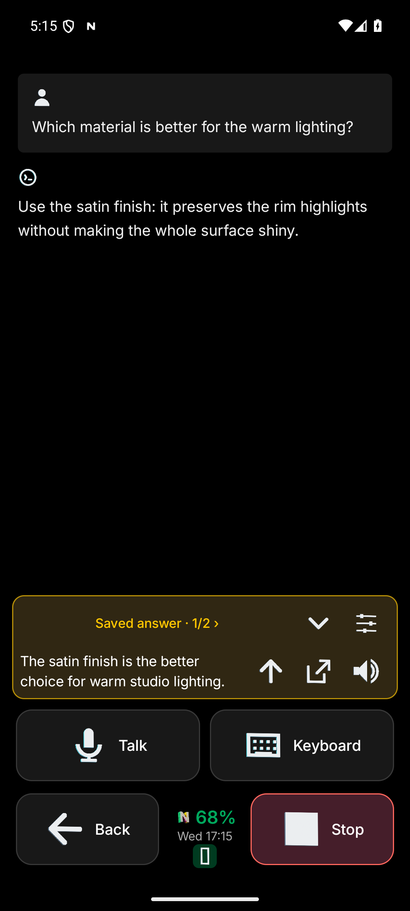
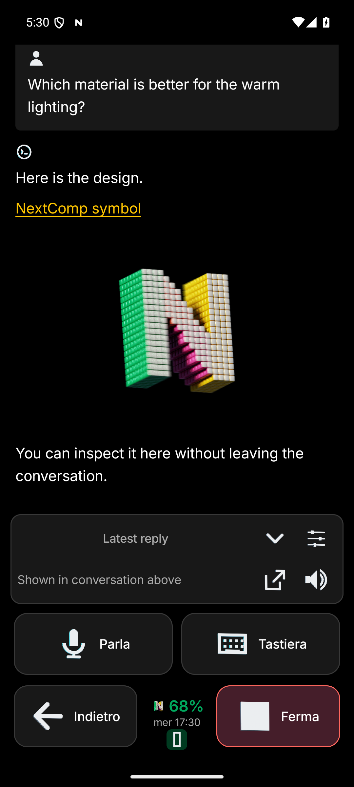

<p align="center">
  
</p>

<h1 align="center">NextComp</h1>

<p align="center"><strong>Your computers. Your agents. With you on Android.</strong></p>

<p align="center">
  <a href="https://github.com/fallsoftco/pocket/releases">Download Android alpha</a> ·
  <a href="#setup">Get started</a> ·
  <a href="docs/README.md">Documentation</a> ·
  <a href="docs/CAPABILITIES.md">Capabilities & evidence</a>
</p>

NextComp is a self-hosted Android interface for working with agents on your own computers. Speak or type a request, continue a task, inspect what it finds, and respond when it needs you—all from your phone. Coding, research, machine inspection and creative work depend on the tools and permissions in your environment.

**Codex + Linux + Android + Tailscale.** Use stock Codex on your Linux workstation, or run it directly on Android through Termux. A persistent coordinator connects your requests to real work sessions, so you can keep directing work as it develops.

> “The next stage is going to be computers as ‘agents.’”
>
> — **Steve Jobs, 1984**, interviewed by Tom Zito for *Access*. [Read the original interview, republished by its author](https://www.thedailybeast.com/steve-jobs-1984-access-magazine-interview). The source establishes the year, not the exact interview date.

**Experimental alpha.** NextComp is an independent [FallSoft](https://github.com/fallsoftco) project. It uses Codex's experimental app-server; compatibility and native voice depend on the CLI and account. See the [tested environments and limitations](docs/CAPABILITIES.md) before installing.

## See it in action

<p align="center">
  
  
</p>

*Native Android UI screenshots with synthetic example conversations, captured during alpha.22 qualification. Left: act on an intermediate answer. Right: inspect an image within the conversation. These illustrate the interface; they are not a live task recording or a guarantee of the latest release's appearance.*

## What you can do

| Experience | How it helps |
| --- | --- |
| **Talk or type** | Address the persistent coordinator or a specific work session. Voice turns use manual recording controls. |
| **Continue real work** | Start tasks, steer active work, queue follow-ups, and resume existing conversations. |
| **Act before the final answer** | Read intermediate findings, reply with their context, and open their source. |
| **Stay informed** | Follow tasks and receive completion alerts, questions and supported approvals on Android. |
| **Inspect results** | Expand commands and changes, browse conversation history, and view shared images with pinch-to-zoom. |
| **Work on the phone itself** | Run stock Codex in Termux; optionally enable owner-controlled Android accessibility tools. |
| **Make reading your own** | Use spoken responses and optional inline language immersion. |

An optional [Losangelex backend](docs/LOSANGELEX-BACKEND.md) connects to your own team service for shared conversations and agent assignments. Team voice is not supported in the first integration.

See the [full product briefing](docs/NEXTCOMP-BRIEF.md) for the vision and the [capability map](docs/CAPABILITIES.md) for implementation evidence and qualification limits.

## Setup

Choose where you want Codex to run:

| | Linux workstation | This Android phone |
| --- | --- | --- |
| **Runtime** | Stock Codex CLI, Node.js 22.13+ | Stock Codex CLI in Termux |
| **Connection** | Private HTTPS; Tailscale Serve recommended | Private loopback bridge |
| **Push notifications** | Your own Firebase project | No Firebase setup required for local execution |
| **Start here** | [Workstation setup](docs/GETTING-STARTED.md#setup) | [Android-local setup](docs/ANDROID_LOCAL.md) |

For the workstation path:

1. Install and authenticate Codex, clone this repository, and run the compatibility preflight.
2. Configure your own Firebase project and start the backend.
3. Expose it privately through Tailscale Serve, install the signed APK, and pair with a one-time code.
4. Test notifications and begin a task.

```bash
git clone https://github.com/fallsoftco/pocket.git
cd pocket
npm ci
codex --version
npm run doctor -- --preflight
```

Then follow the [complete setup guide](docs/GETTING-STARTED.md#setup). The preflight needs an existing authenticated shared Codex runtime; it does not require Firebase. The documented stock CLI baselines are **0.157.1 on Linux** and **0.158.0 in Termux**. Other versions require verification.

Android **9+** is required; workstation push needs Google Play services. Physical testing covers a Pixel 9 Pro Fold. Download from the [release list](https://github.com/fallsoftco/pocket/releases), which includes prerelease alphas, and verify the published checksum. Check [signing and upgrade compatibility](docs/RELEASING.md) before replacing an existing installation.

## Your infrastructure, your control

```text
Android ← private HTTPS / WebSocket → your Linux backend ↔ stock Codex
   ↑ Firebase push from your own project

Android ← private loopback bridge → stock Codex in Termux
```

FallSoft operates neither backend. Workstation transcripts and attachments stay on your host and are fetched through its authenticated connection. Firebase carries notification titles and bounded previews; native voice sends selected audio or speech content through OpenAI's account transport. Read [Privacy](PRIVACY.md) for the complete data flow.

NextComp is designed for **one owner and their trusted phones**. A paired phone can control that owner's tasks. New tasks default to full filesystem/network permissions with command approvals disabled; change **Full permissions for new tasks** in Settings or on the New task screen before starting work if you want workstation approval mode. Phone-local tasks require full filesystem access.

Use private Tailscale Serve, keep credentials out of the repository, and never expose the raw Codex socket. See [Security](SECURITY.md).

## Documentation and support

- [Setup and everyday use](docs/GETTING-STARTED.md): pairing, notifications, voice, permissions and connection troubleshooting.
- [Documentation index](docs/README.md): architecture, deployment, optional backends and features.
- [Capabilities and evidence](docs/CAPABILITIES.md): what is implemented, what was observed, and what remains unverified.
- [Report a bug](https://github.com/fallsoftco/pocket/issues): include versions and reproducible steps; remove private task text and credentials.

Formerly **Pocket**. Existing installations, pairings, package IDs and deep links remain compatible; some setup commands and Android labels retain that name.

## Contributing

Contributions and reproducible bug reports are welcome. Read the [maintainer policy](MAINTAINER_POLICY.md) before proposing a change. For development requirements and validation commands, see [Develop and build](docs/GETTING-STARTED.md#develop-and-build).

## License

Original code and icon are [MIT licensed](LICENSE). Third-party components retain their own licenses; see [Third-party notices](THIRD_PARTY_NOTICES.md).
