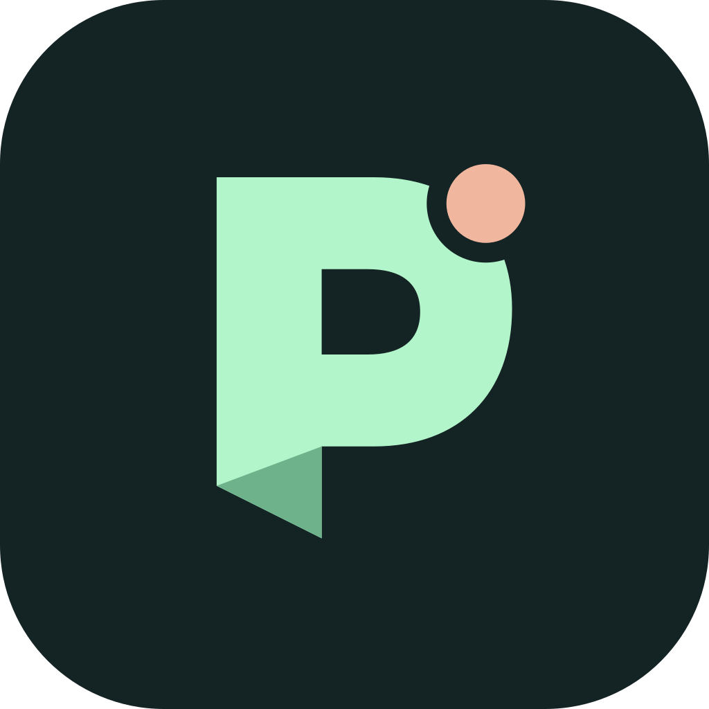

<p align="center"></p>

# Pocket

**Your Codex workstation, within reach.** A self-hosted Android companion for stock Codex CLI by [FallSoft](https://github.com/fallsoftco).

Start tasks from your phone, follow the conversation in order, and reply when Codex needs you. Pocket connects to your existing Codex runtime; no fork, app store, or FallSoft-operated server is required.

[Download the Android alpha](https://github.com/fallsoftco/pocket/releases) · [Setup](#setup) · [Privacy](PRIVACY.md) · [Security](SECURITY.md) · [Verification](docs/VERIFICATION.md)

> **Experimental alpha.** Tested with Codex CLI 0.157.1 on Linux. Pocket requires that CLI's existing shared app-server Unix socket. This transport is experimental; installations without it are not supported yet. Run `npm run doctor` to check yours. This is an independent project, not an OpenAI product.

## What it does

- Start a task in a workstation project, or continue an existing conversation.
- Read prompts, progress, commands, tool results, file changes, questions, and final responses in chronological order. Expand output and load earlier turns.
- Reply from an Android notification, guide an active turn, or stop a selected task.
- Receive Firebase push when followed work finishes or needs your attention.
- Ask Codex to notify you under a condition: **“Use Pocket to notify me when the tests pass, with a short summary.”**
- Choose synthesized tones, optional offline spoken labels, or system notification audio. Actionable items have bounded reminders, dismissal, and snooze.
- Open explicitly shared attachments from your authenticated workstation.

Pocket is for **one owner and their trusted phones**. A paired phone can read and control that owner's Codex tasks. It is not a shared hosting or multi-user permissions system.

<p></p>

## How it connects

```text
Codex CLI ← shared local app-server socket → Pocket backend
                                                ↕ HTTPS / WebSocket
                                           Android app
                                                ↑ background alerts
                                       Your Firebase project
```

Your workstation hosts the application and stores task data. Firebase Cloud Messaging (FCM) transports notification titles and bounded text previews through Google. Full transcripts and attachments are fetched from your workstation. The APK gets your Firebase client configuration when paired; it contains no shared Firebase project or server credential.

## Requirements

- Linux workstation with Node.js **22.13+**, authenticated Codex CLI, and its shared app-server socket.
- Android **9+ (API 28)** with Google Play services for FCM. Physical testing currently covers a Pixel 9 Pro Fold; other vendors are unverified.
- Your own Firebase project with Cloud Messaging enabled and a server credential.
- A trusted HTTPS connection from phone to workstation. Tailscale Serve is the recommended private-network deployment. Both devices must belong to your tailnet to read/reply; FCM alerts can arrive without Tailscale connected.

The workstation must remain online for Codex work and new notifications. There is no always-on Android foreground service or battery-exemption requirement. Android force-stop prevents push until you reopen the app.

## Setup

### 1. Install the backend

```bash
git clone https://github.com/fallsoftco/pocket.git
cd pocket
npm ci
```

Run Codex normally and authenticate it. Pocket connects to the existing socket at `~/.codex/app-server-control/app-server-control.sock` (or under `CODEX_HOME`). Set `CODEX_SOCKET` if your installation uses another existing shared socket. Pocket does not start a competing app-server or migrate your conversations.

### 2. Configure your Firebase project

Create or choose a project in the [Firebase console](https://console.firebase.google.com/). Enable the Firebase Cloud Messaging API and Firebase Management API. Obtain a private service-account JSON credential for your project; never put it in the repository.

```bash
node scripts/configure-firebase.mjs YOUR_PROJECT_ID /private/path/service-account.json
```

This registers the Android package `co.fallsoft.pocket` if needed and writes private configuration into ignored `data/`. Setup needs permission to list/create Firebase Android apps and read their configuration. Sending requires `cloudmessaging.messages.create`; for ongoing operation use a suitably scoped service account (for example, the Firebase Cloud Messaging API Admin role). The setup script copies the supplied credential into `data/firebase-admin.json`; you may replace it with a narrower sending credential after setup. See [Firebase's server authorization guide](https://firebase.google.com/docs/cloud-messaging/auth-server).

The same signed APK works with each owner's Firebase project. You do not need to rebuild it, add `google-services.json`, or share credentials with FallSoft.

### 3. Start and expose Pocket privately

```bash
npm start
```

Keep that running; in another terminal:

```bash
tailscale serve --bg --https=8447 http://127.0.0.1:18880
npm run doctor
```

Use the HTTPS address printed by Tailscale. Do **not** use Funnel or expose the raw Codex socket. The backend binds only to loopback. If port 8447 is already used by another service, select a free HTTPS port. For background startup, adapt [the systemd template](deploy/codex-pocket.service.example) using [the deployment guide](docs/DEPLOYMENT.md).

### 4. Install and pair Android

Download `pocket-0.4.1-alpha.1.apk` from [Releases](https://github.com/fallsoftco/pocket/releases), verify its checksum, and install it. Android will ask to allow installation from your browser or file manager. Alternatively use `adb install pocket-0.4.1-alpha.1.apk`.

On the workstation, from the checkout:

```bash
POCKET_PUBLIC_URL=https://YOUR_WORKSTATION.YOUR_TAILNET.ts.net:8447 node scripts/pair-device.mjs
```

Enter that HTTPS address and the one-time code in Pocket, then grant notification permission. Codes expire after 15 minutes and work once. An optional ADB device argument opens the prefilled form; it still requires tapping Connect.

In Settings, wait for **Firebase push is ready**, then send a test notification. This checks your own project/device configuration.

### 5. Let Codex notify you

```bash
codex mcp add pocket -- node /absolute/path/pocket/server/mcp.mjs
```

Start a new Codex client session so it loads the tool. Ask it when you want a notification. The `notify_user` tool uses the current `CODEX_THREAD_ID`; it never chooses another recipient. Custom data directories/ports must also be passed to the MCP command; see [deployment](docs/DEPLOYMENT.md).

## Everyday use

**New task** selects an existing absolute workstation folder and prompt. Codex inherits the workstation's model, approval settings, and project instructions. Task creation and replies use durable IDs; ambiguous delivery is shown for review instead of automatically duplicating work.

Open a task and tap its bell to follow it. Replying also follows it. The conversation preserves turn/item order, including compact expandable commands and diffs. Scroll up without losing your place; **Latest** returns to live activity. **Load earlier turns** pages backward. Public reasoning summaries can appear; raw reasoning is excluded.

**Queued** means Pocket received a reply; **sent** means Codex accepted it, not that the task finished. Native questions and supported command/file approvals retain their exact outstanding request IDs. Unsupported request types must be handled in the terminal. Nothing is automatically approved.

Questions, approvals, and errors appear in **Needs you**. Reminders use delays of 5 minutes, then 15 and 30 minutes between repeats, up to three repeats. Swipe away, dismiss, reply, or resolve the request to stop them. **Later · 30m** snoozes. Android may delay these approximate timers; opening a task alone does not dismiss its request.

Optional Speech prepares generic labels using an installed offline English voice; it never reads task text aloud. Tones are the fallback. Audio respects notification volume, Android channel settings, and Do Not Disturb.

## Manage devices and data

```bash
node scripts/devices.mjs list
node scripts/devices.mjs revoke DEVICE_ID
```

Revocation closes that device's live connections and removes its push registration. It cannot erase already delivered content from a phone. Unpairing while offline only clears the phone immediately; revoke on the workstation if the server was unreachable.

`data/` contains credentials, paired-device records, notifications, outbox state, and shared attachments. Keep it private and back it up securely. The owner token grants local administration. Never include this directory in a support report. See [privacy](PRIVACY.md) and [security](SECURITY.md).

## Develop and build

```bash
npm test
npm audit --omit=dev
cd android
./gradlew assembleDebug lintRelease
```

Android builds need JDK 17+, SDK 36, and an SDK path in `ANDROID_HOME` or ignored `android/local.properties`. The Gradle wrapper is included. See [release signing and upgrades](docs/RELEASING.md) for signed builds. GitHub Actions runs backend tests, dependency audit, Android lint, and an unsigned release build.

Public alpha builds use a stable FallSoft release certificate. They cannot update earlier personal debug builds or independently signed builds in place. See the migration instructions before uninstalling anything.

Original code and icon are [MIT licensed](LICENSE). Third-party components retain their own licenses; see [notices](THIRD_PARTY_NOTICES.md). Contributions and reproducible bug reports are welcome; remove private task text and credentials first.
